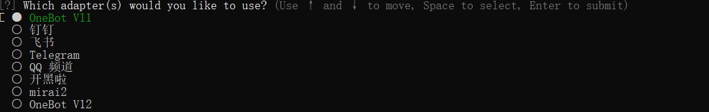

**基于Nonebot2的QQ机器人**

## 目前已实现的功能

## TODO 

## 搭建一个基本的QQ机器人

**&ensp;&ensp;[NB官方文档](https://v2.nonebot.dev/)**
### 安装必要库

> pip install nb_cli  \
> nb adapter install OneBot

### 创建项目
> nb create  

&ensp;&ensp;`空格`选择选项

&ensp;&ensp;创建成功后，文件目录如下:

&ensp;&ensp;其中`env`文件可合并成一个文件，在其中填写相关配置信息

### 配置.env文件

`HOST`与`POST`要与go-cqhttp配置一致

### go-cqhttp及配置
&ensp;&ensp;根据系统选择合适的[go-cqhttp](https://github.com/Mrs4s/go-cqhttp/releases)版本
(本文选择的是v1.0.0-rc2
    运行`.bat`文件，选择`反向 Websocket 通信`

&ensp;&ensp;在`config.yml`中配置相关信息（密码、反向WS Universal 地址等）  
&ensp;&ensp;**反向WS Universal地址**修改为 `ws://HOST:POST/onebot/v11/ws/`(eg:ws://127.0.0.1:22334/onebot/v11/ws/)

### 运行Bot
> nb run 或者 运行bot.py  \
> 运行go-cqhttp.bat

